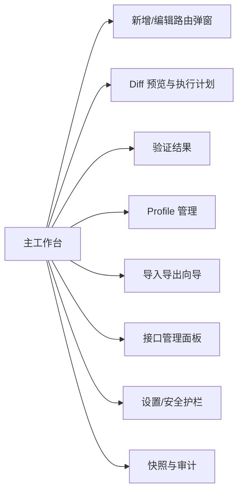
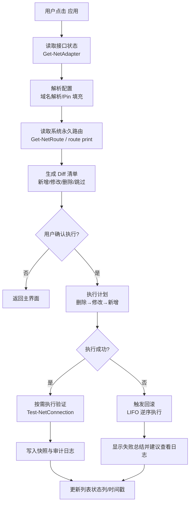
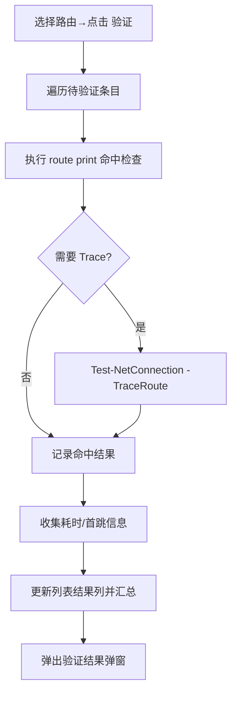
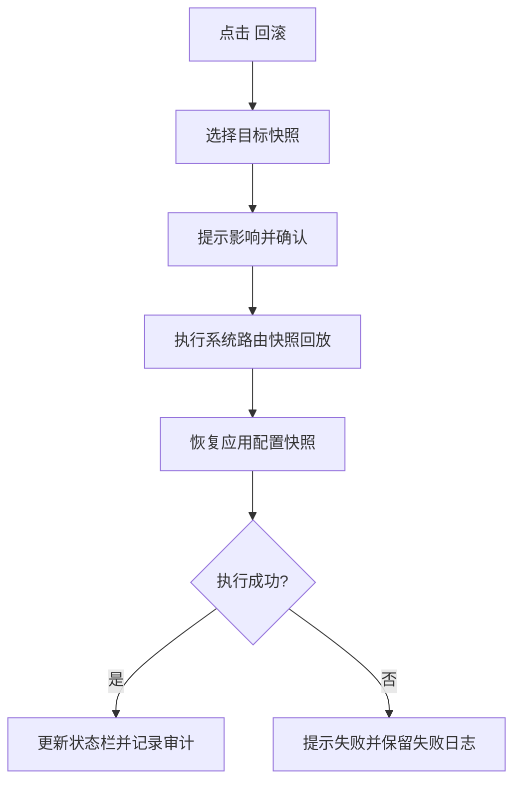
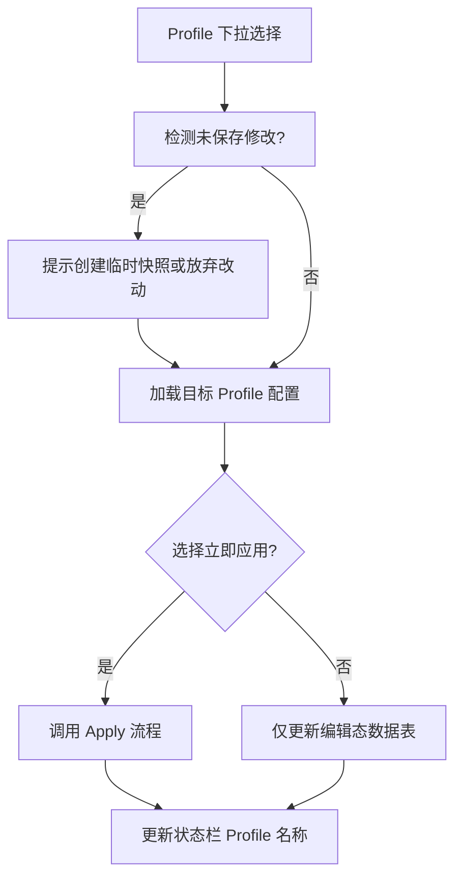
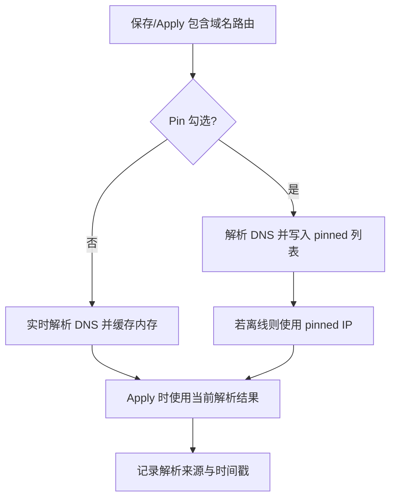

# 路由管理工具原型说明

## 1. 原型概要

- **目标**：基于现有《设计文档》落地 Windows 本地 GUI 原型，用于查看/维护/应用永久 IPv4 路由白名单，实现便捷、安全、可审计的运维体验。
- **目标用户**：网络/安全运维人员，需频繁维护直连白名单或调试 WireGuard 等隧道场景。
- **使用场景**：
  - 日常新增、修改、删除直连路由，并保留描述、分组信息。
  - 在 ifIndex 变化、WireGuard 全隧道或多 Profile 切换时，快速对比差异并一键应用。
  - 通过验证、快照、审计确保变更可追踪与可回滚。
- **原型范围**：覆盖核心桌面窗口、主要弹窗（新增/编辑、Diff 预览、验证结果、Profile 切换、导入导出、设置）、关键流程图与交互说明。
- **设计原则**：可见性（即时报错/状态）、幂等执行、安全护栏、默认持久、面向批量操作、PyQt6 易实现。

## 2. 信息架构

### 2.1 模块与需求映射

| 模块 | 子功能 | 对应设计文档章节 |
| --- | --- | --- |
| 主工作台 | 顶部工具栏、分组树、路由表格、底部状态栏 | §3.1、§3.2、§3.3、§3.6 |
| 路由编辑弹窗 | 目标/网关/接口/Metric/描述/选项、校验 | §3.2、§8 |
| Diff 预览弹窗 | 新增/修改/删除列表、执行计划预览、确认执行 | §3.3 |
| 验证结果弹窗 | 命中检查、TraceRoute、耗时、结果标记 | §3.4 |
| 接口管理面板 | 接口列表、默认物理接口设置、WireGuard 检测 | §3.5 |
| Profile 管理弹窗 | 列表、切换、导入导出、加载策略 | §3.6、§3.8 |
| 审计与快照 | 快照列表、回滚按钮、日志查看 | §3.7 |
| 导入导出向导 | CSV/JSON 导入校验、导出选项 | §3.8 |
| 安全护栏与设置 | 高级模式、冲突保护、阈值配置 | §3.9 |

### 2.2 页面导航结构



## 3. 页面原型详解

### 3.1 主工作台布局（低保真）

```
+--------------------------------------------------------------------------------------------------------------+
| Profile: [home ▼]  | 读取接口 | 应用 | 验证 | 回滚 | 导入 | 导出 | 设置 | 帮助                         |
+--------------------+-------------------------------------------------------------------------------+--------+
| 分组树                                                                                           | 搜索🔍 |
| - All                                                                                             | [ target/描述/组 ] |
| - 未分组                                                                                          |            |
| - aliyun                                                                                          |            |
|   - ECS                                                                                           | 表头: ✔ 目标  掩码  网关  接口  Metric  持久  描述  分组  结果 |
| - office                                                                                          |            |
+--------------------+-------------------------------------------------------------------------------+--------+
| 路由表（可编辑单元格，支持多选复选框 / Shift 选择）                                                         |
| - 行内状态：启用勾选、描述悬停、结果列显示成功/失败图标及时间戳                                                  |
+--------------------------------------------------------------------------------------------------------------+
| 底部状态栏：默认物理接口 vEthernet (mychange) | 网关 192.168.1.1 | WireGuard: Full Tunnel | 上次应用：成功 09:32 |
+--------------------------------------------------------------------------------------------------------------+
```

**交互要点**：
- 表格支持过滤、排序、快捷键（Del 删除、Ctrl+A 全选、Ctrl+F 聚焦搜索）。
- 多选后工具栏按钮 `应用/禁用/删除` 变为批量模式；状态栏显示选中条目数。
- 结果列点击可查看最近一次应用/验证详情。
- 顶部 Profile 下拉切换后，可选择“仅加载”或“立即应用”。

### 3.2 顶部工具栏内容

| 控件 | 说明 | 反馈/状态 |
| --- | --- | --- |
| Profile 下拉 | 列出已配置的 JSON Profile，提供“管理…”入口 | 切换时弹出确认框（仅加载/立即应用） |
| 读取接口 | 调用 PowerShell 获取 Up 状态接口并刷新缓存 | 成功 toast / 失败警示条；状态栏刷新 |
| 应用 | 打开 Diff 预览 → 确认后执行 | 执行期间按钮禁用、显示进度、日志区滚动 |
| 验证 | 对选中或全部需验证条目，执行命中/Trace | 完成后打开验证弹窗 |
| 回滚 | 基于最近快照回滚系统与配置 | 弹窗选择目标快照，执行时提示需管理员权限 |
| 导入/导出 | 打开向导（CSV/JSON） | 导入成功后提供校验报告 |
| 设置 | 打开全局设置（安全护栏/默认值） | 保存需重启提示或即时生效提示 |
| 帮助 | 打开帮助页或链接到 docs | 无阻断 |

### 3.3 左侧分组树

- 默认节点：`All`、`未分组`、按 `group` 生成的层级。
- 支持右键：新增分组、重命名、删除（空分组）、折叠/展开。
- 分组选择影响右侧表格过滤，顶部搜索在当前分组内生效。
- 当 WireGuard 全隧道警告触发时，在树顶部显示黄色提示条。

### 3.4 路由表格列定义

| 列 | 类型/控件 | 默认值 | 说明 |
| --- | --- | --- | --- |
| 启用 | 复选框 | 勾选 | 控制路由是否参与 Apply；禁用项在 Diff 中标记为 `skip` |
| 目标 | 可编辑文本/提示 | 必填 | 支持 IP/CIDR/域名；域名旁显示解析状态与 pin 图标 |
| 掩码 | 只读文本 | 由 CIDR 计算 | CIDR 变更后自动刷新；域名显示 `-` |
| 网关 | 可编辑文本 | 接口默认 | 支持自动补全；校验同网段 |
| 接口 | 下拉选择 | 上次选择或默认物理接口 | 显示接口名；悬浮提示 ifIndex / MAC |
| Metric | 数字输入 | 默认 5 | 范围 1–999；支持批量编辑 |
| 持久 | 复选框 | 勾选 | 控制是否 `route -p`；后端默认 true |
| 描述 | 文本框 | - | 建议必填；用于过滤 |
| 分组 | 下拉/标签 | - | 支持多选分组（逗号分隔）或单选，视实现确定 |
| 结果 | 状态标签 | - | 显示最近一次 Apply/Verify 结果与时间 |

### 3.5 底部状态栏

- 左侧：默认物理接口名称/ifIndex/网关；点击可快速打开接口管理。
- 中部：WireGuard 检测结果（绿色/黄色/红色状态点 + 文案提示）。
- 右侧：上次应用时间、结果（成功/失败/部分失败）、当前 Profile 名称。
- 当存在未保存更改时，状态栏显示“* 未保存更改（X 项）”并提示用户 Apply。

### 3.6 关键弹窗与面板

#### 3.6.1 新增/编辑路由弹窗

```
[目标] [CIDR] [掩码] (实时转换)           [验证目标按钮]
[网关] [接口下拉 ▼]  [自动填充网关]
[Metric] [持久 ✓] [验证连通性 ✓] [固定解析 ✓]
[描述 (多行输入)]
[分组选择]
[保存] [保存并继续新增] [取消]
```

| 字段 | 说明 | 校验/反馈 |
| --- | --- | --- |
| 目标 | 支持 IP/CIDR/域名；域名时可展示实时解析结果 | 非法 IP/CIDR/域名阻断保存；域名解析失败提供“允许使用 pin 缓存”选项 |
| CIDR/掩码 | CIDR 变动自动刷新掩码 | /32 固定掩码；域名情况下 CIDR 必填 |
| 网关 | 默认取接口缓存中的网关 | 校验是否与接口同网段；失败时红色提示 |
| 接口 | 下拉显示 Name + ifIndex | 选择时自动更新网关建议值 |
| Metric | 数字框 | 超范围提示；自动建议 5 |
| 持久 | 复选框 | 取消时提示“非持久路由可能随重启失效” |
| 验证连通性 | 仅 Apply 后执行验证流程 | 工具栏验证按钮读取此标记 |
| 固定解析 (Pin) | 针对域名 | 勾选后在配置文件 `pinned` 中持久化 |
| 描述 | 多行文本 | 可设为必填，空值时弹出确认提示 |
| 分组 | 标签选择 | 支持创建新分组 |

#### 3.6.2 Diff 预览弹窗

```
┌─────────────────────────── Route Apply 计划 ────────────────────────────┐
│ 变更统计：新增 3 | 修改 2 | 删除 1 | 跳过 4                               │
│-----------------------------------------------------------------------│
│ 操作 | 目标         | 网关        | 接口             | Metric | 说明       │
│ add  | 10.0.0.0/24  | 192.168.1.1 | vEthernet(...)   | 5      | 新增白名单 │
│ ...                                                                   │
│-----------------------------------------------------------------------│
│ [√] 执行后自动验证  | [√] 失败自动回滚  | 日志输出面板（实时滚动）            │
│ [执行] [仅保存计划] [取消]                                                │
└───────────────────────────────────────────────────────────────────────┘
```

- 点击“执行”后进入执行状态，日志面板显示 `route add/change/delete` 命令与返回码。
- 失败时高亮对应行并展示可回滚动作；提供“立即回滚”按钮。

#### 3.6.3 验证结果弹窗

| 列 | 含义 |
| --- | --- |
| 目标 | 验证的目标主机/IP |
| 命中结果 | 是否命中系统路由，展示第一跳接口 |
| Trace | 首跳 IP/耗时；失败时展示错误信息 |
| 时间 | 验证耗时 ms |
| 日志 | 可展开查看命令输出 |

底部提供“复制报告”“保存为 CSV”“重新验证失败项”按钮。

#### 3.6.4 Profile 管理弹窗

- 左侧列表展示 Profile 名称、最后修改时间。
- 右侧按钮：`加载到编辑态`、`加载并立即应用`、`导入`、`导出`、`新建`、`删除`。
- 切换 Profile 时提示是否覆盖当前改动，并可创建临时快照。

#### 3.6.5 导入导出向导

1. 选择 CSV 或 JSON。
2. 上传/粘贴内容 → 解析预览 → 校验报告（字段缺失、CIDR 错误、重复项）。
3. 冲突处理策略：覆盖、追加、跳过。
4. 导入成功后提供“立即应用”或“仅保存”选项。

#### 3.6.6 快照/回滚对话框

- 展示系统路由快照与应用配置快照列表，包含时间戳、摘要、创建方式。
- 支持比较两份快照差异（Mermaid Diff 或文本差异预览）。
- 回滚操作需再次确认并提示需要管理员权限。

#### 3.6.7 设置/安全护栏

- 默认 Metric、默认验证选项、默认物理接口匹配规则。
- 安全护栏开关：禁止默认路由修改、本地子网保护、网关冲突检测、启用高级模式。
- WireGuard 提醒策略：检测 `/1` 路由时弹出提醒是否转换为 /32。
- 日志滚动上限、自定义命令延迟、并发度配置。

## 4. 关键流程图

### 4.1 Apply 执行流程



### 4.2 验证流程



### 4.3 快照回滚流程



### 4.4 Profile 切换流程



### 4.5 域名 Pin 与缓存更新



## 5. 数据结构与存储映射

| 数据项 | 存储位置 | 说明 |
| --- | --- | --- |
| Profile 配置 | `profiles/*.json`（默认 `home.json`） | 与设计文档 §4 JSON 结构一致 |
| DNS Pin | `pinned` 字段 | 域名→IP 列表；在 UI 中可清空/刷新 |
| 运行态缓存 | 内存字典 | 接口名→ifIndex、域名解析结果 |
| 快照 | `snapshots/system-routes-YYYYMMDD-HHMMSS.json`、`snapshots/app-config-...` | Apply 前自动生成 |
| 审计日志 | `logs/rtmgr.log` 滚动 | 记录时间、用户、命令、返回码、结果 |
| 导入导出 | CSV/JSON | 保持字段与 UI 一致，含分组、描述 |

## 6. 交互细节与状态反馈

- **批量操作**：多选后工具栏出现批量启用/禁用/删除按钮，执行后局部刷新表格。
- **过滤与搜索**：顶部搜索框支持目标、描述、分组关键字；支持语法 `group:aliyun`。
- **内联编辑**：双击单元格编辑，按 Enter 保存、Esc 撤销；保存后高亮条目标记为“未应用”。
- **安全护栏提示**：当用户尝试修改默认路由或本地子网时，弹出阻断对话框并引导打开高级模式。
- **WireGuard 提醒**：检测到 `/1` 路由后，在表格顶部展示黄色提示，“当前为全隧道模式，建议使用 /32”。
- **权限自检**：程序启动时检测管理员权限，不足时弹出红色横幅，按钮 `应用/回滚` 禁用。
- **日志查看**：Diff 弹窗与验证弹窗内均有“复制命令”与“打开日志文件”快捷入口。

## 7. 技术实现提示（PyQt6 映射）

| 原型控件 | PyQt6 建议组件 | 备注 |
| --- | --- | --- |
| 主窗口框架 | `QMainWindow` + `QSplitter` | 左右分栏（分组树 + 表格） |
| 分组树 | `QTreeView` + `QStandardItemModel` | 支持右键菜单、自定义图标 |
| 路由表格 | `QTableView` + 自定义 `QAbstractTableModel` | 支持勾选、下拉、内联编辑 |
| 顶部工具栏 | `QToolBar` + `QAction` | 动态启用/禁用 |
| 搜索框 | `QLineEdit` + `QCompleter` | 实现过滤 |
| 弹窗 | `QDialog` + `QFormLayout` / `QStackedWidget` | 复用表单组件 |
| 日志面板 | `QPlainTextEdit`（只读） | 支持滚动与复制 |
| 图标指示 | `QLabel` + `QPixmap` | 显示状态颜色 |

## 8. 测试与验收要点

- **功能验证**：按设计文档 §15 场景执行（新增→应用→验证→修改→删除→回滚）。
- **ifIndex 漂移**：禁用/启用接口后，重新 Apply 仍成功。
- **域名 Pin**：断网后使用 pinned IP 仍可 Apply。
- **安全护栏**：尝试修改默认路由时被阻止，开启高级模式后可执行但记录审计。
- **日志与快照**：每次 Apply 前后均生成快照；失败后可成功回滚。
- **WireGuard 提示**：检测 `/1` 路由时 UI 提示准确。

## 9. 后续迭代建议

- 支持 Dark Mode 与自定义列显示。
- 集成命令执行耗时监控，超时自动重试/提示。
- 引入脚本模式导出（批量命令预览）。
- 提供操作引导/教学模式，帮助新用户快速上手。

---

> 本原型文档依据《docs/设计文档.md》整理，确保覆盖核心需求，并为后续 PyQt6 实现、PyInstaller 打包及测试工作提供清晰参考。


